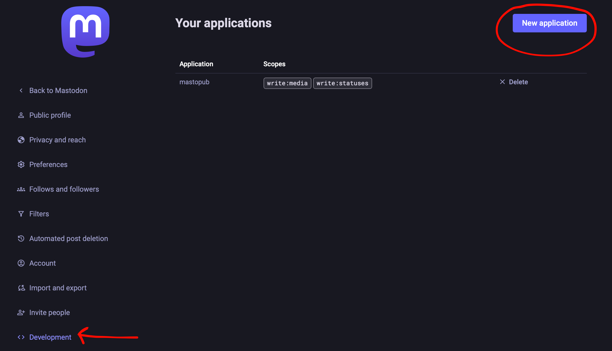
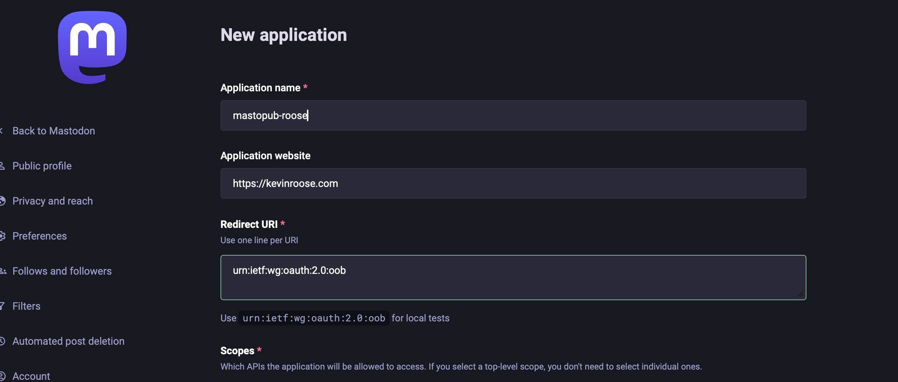
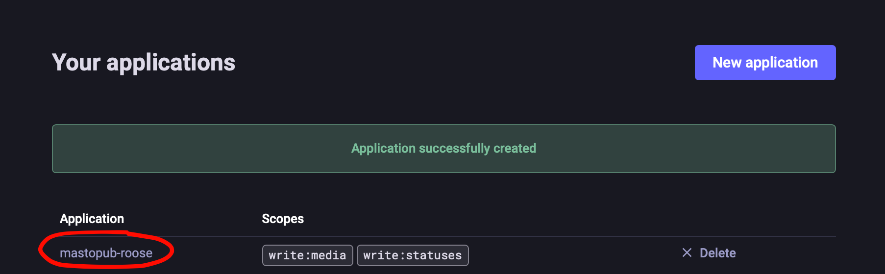
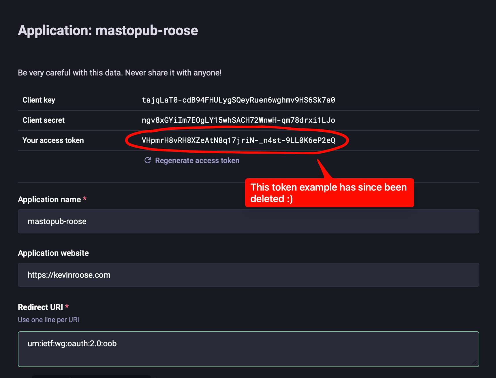
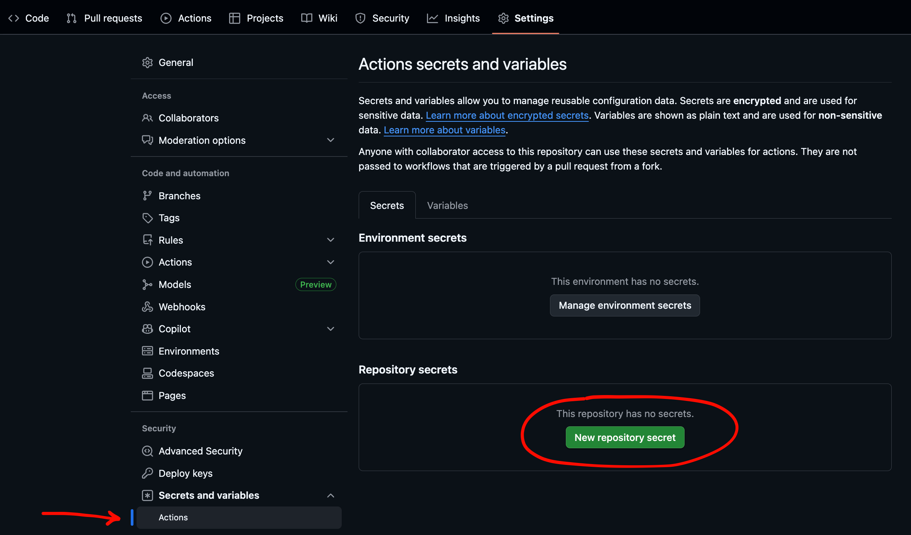
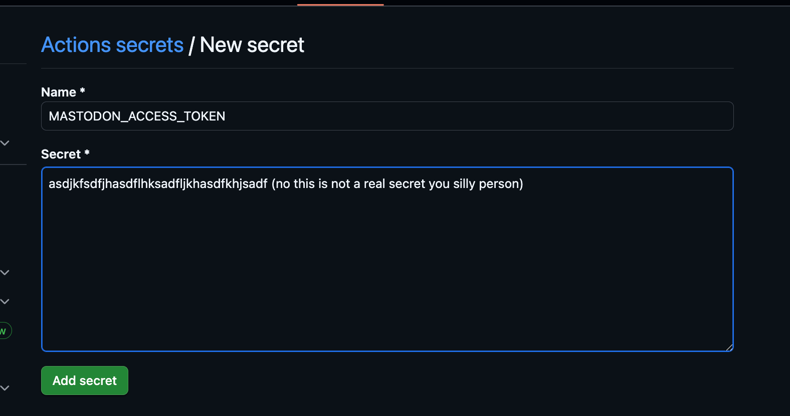

# Mastopub

Automatically publish your Hugo blog posts to Mastodon.

Add `mastodon: true` to a post's frontmatter, push to GitHub, and it shows up on Mastodon. That's it.

## See It In Action

Here's a real example from [mreider.com](https://mreider.com):

**The blog post:** [Lost and Found](https://mreider.com/life/lost-and-found/)

**The frontmatter change:** [Just two lines added](https://github.com/mreider/mreider.com/commit/30b13f7c586c09e1f34714702ff33cb026562665)

```yaml
mastodon: true
mastodon_thread: true
```

**The result on Mastodon:** [Full thread with images](https://ieji.de/@mateo/115910965322919799)

---

## Two Posting Modes

**Single Post (default)** — A toot announcing your post with a link and featured image:
```yaml
mastodon: true
```
Result: "My latest post: Lost and Found" + link + image

**Thread Mode** — Your entire article as a series of connected posts:
```yaml
mastodon: true
mastodon_thread: true
```
Result: Full article split into chunks, images attached where they appear in the text.

You can also write custom text for single posts:
```yaml
mastodon: true
mastodon_text: "Just wrote about Austria's incredible lost-and-found system."
```

---

## Setup Guide

### Step 1: Create a Mastodon Application

Go to your Mastodon instance's settings. In the left sidebar, click **Development**.



Click **New application** and fill in the form:
- **Application name:** Whatever you want (e.g., "Blog Publisher")
- **Website:** Your blog URL (optional)
- **Redirect URI:** Leave as default



Scroll down to **Scopes**. Check only these two:
- **write:statuses** — to post toots
- **write:media** — to upload images

Uncheck everything else.


Click **Submit**. You'll see your new application listed.



Click on your application name to see its details. You'll see three values:

```
Client key:        (ignore)
Client secret:     (ignore)
Your access token: ← Copy this one
```



Copy the **access token**. That's the only thing you need.

---

### Step 2: Add the Token to GitHub

Go to your blog's GitHub repository. Navigate to:

**Settings → Secrets and variables → Actions**



Click **New repository secret** and add:
- **Name:** `MASTODON_ACCESS_TOKEN`
- **Secret:** Paste your access token



Click **Add secret**.

---

### Step 3: Create the Workflow File

Create this file in your blog repository at `.github/workflows/mastodon.yml`:

```yaml
name: Post to Mastodon

on:
  push:
    branches:
      - main
    paths:
      - 'content/**'

  workflow_dispatch:
    inputs:
      dry_run:
        description: 'Dry run (test without posting)'
        type: boolean
        default: false

jobs:
  post:
    runs-on: ubuntu-latest
    steps:
      - uses: actions/checkout@v4

      - name: Post to Mastodon
        uses: mreider/mastopub@v1
        with:
          mastodon_instance: 'https://mastodon.social'  # ← Your instance
          mastodon_token: ${{ secrets.MASTODON_ACCESS_TOKEN }}
          blog_url: 'https://yourblog.com'              # ← Your blog URL
          dry_run: ${{ inputs.dry_run || 'false' }}

      - name: Commit tracking file
        run: |
          git config user.name "${{ github.actor }}"
          git config user.email "${{ github.actor_id }}+${{ github.actor }}@users.noreply.github.com"
          git add .github/mastodon-published.json
          git diff --staged --quiet || git commit -m "Track published Mastodon posts"
          git push
```

Change these two values:
- `mastodon_instance`: Your Mastodon server (e.g., `https://mastodon.social`, `https://hachyderm.io`)
- `blog_url`: Your blog's URL

---

### Step 4: Mark Posts for Mastodon

Add frontmatter to any post you want to publish:

```yaml
---
title: "My Blog Post"
date: 2025-01-17
image: "/images/featured.jpg"
mastodon: true
---
```

Push to GitHub. The workflow runs automatically and posts to Mastodon.

---

## Frontmatter Reference

| Field | Required | Description |
|-------|----------|-------------|
| `mastodon: true` | Yes | Enable Mastodon posting |
| `mastodon_text` | No | Custom text for single post |
| `mastodon_thread: true` | No | Post full article as thread |
| `image` | No | Featured image (attached to first post) |

---

## How It Works

1. **Finds posts** with `mastodon: true` in frontmatter
2. **Checks** `.github/mastodon-published.json` to skip already-posted articles
3. **Uploads images** from your blog to Mastodon
4. **Posts** either a single toot or a thread (depending on mode)
5. **Tracks** what's been posted to prevent duplicates

### Image Handling

- **Featured image** (from `image:` frontmatter) goes on the first post
- **Body images** (markdown ``) attach to whichever chunk contains that text
- Each post can have up to 4 images (Mastodon's limit)

### Content Processing

- Removes markdown formatting (bold, links, code blocks, etc.)
- Splits at paragraph boundaries, then sentences
- Each chunk is ≤480 characters (under Mastodon's 500 limit)

---

## Testing

Run the workflow manually with "dry run" enabled to see what would be posted without actually posting:

1. Go to **Actions** → **Post to Mastodon**
2. Click **Run workflow**
3. Check **Dry run**
4. Click **Run workflow**

Check the logs to see the output.

---

## Troubleshooting

**"401 Unauthorized"**
- Check that your access token is correct
- Make sure the token has `write:statuses` and `write:media` scopes
- Verify the `MASTODON_ACCESS_TOKEN` secret is set in GitHub

**"No new posts to publish"**
- Check that your post has `mastodon: true` in the frontmatter
- Check `.github/mastodon-published.json` — the post might already be tracked

**Images not appearing**
- Make sure your token has `write:media` scope
- Check that image URLs are publicly accessible

---

## Configuration

| Input | Required | Default | Description |
|-------|----------|---------|-------------|
| `mastodon_instance` | Yes | — | Your Mastodon instance URL |
| `mastodon_token` | Yes | — | Your access token (use a secret) |
| `blog_url` | Yes | — | Your blog's base URL |
| `content_dir` | No | `content` | Path to Hugo content directory |
| `visibility` | No | `public` | Post visibility: `public`, `unlisted`, `private` |
| `dry_run` | No | `false` | Test without posting |

---

## License

MIT
